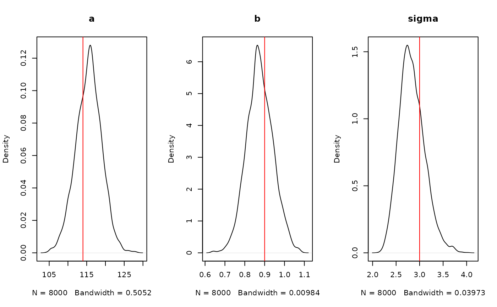

# Introduction to monty

This vignette is an introduction to some of the ideas in `monty`. Please
note that the interface is not yet stable and some function names,
arguments and ideas will change before the first generally usable
version.

``` r
library(monty)
```

## The basic idea

Draw samples from a model using Markov Chain Monte Carlo methods. To do
this you will need:

- A **model**: this is a
  [`monty_model()`](https://mrc-ide.github.io/monty/reference/monty_model.md)
  object and minimally knows about the names of its parameter vector
  (which is an unstructured real-valued vector) and can compute a log
  probability density. It may also be able to compute a gradient of this
  log density, or sample directly from parameter space (e.g., if it
  represents a prior distribution).
- A **sampler**: this is some method of drawing samples from the model’s
  distribution in a sequence. We define several different sampler types,
  with the simplest one being
  [`monty_sampler_random_walk()`](https://mrc-ide.github.io/monty/reference/monty_sampler_random_walk.md),
  which implements a simple Metropolis algorithm random walk.
- A **runner**: this controls how the chains will be run (e.g., one
  after another or in parallel).

The system is designed to be composable; you can work in a Bayesian way
by defining a model representing a likelihood and another model
representing a prior and then pick a sampler based on the capabilities
of the model, and pick a runner based on the capabilities your computer.

The
[`monty_model()`](https://mrc-ide.github.io/monty/reference/monty_model.md)
interface is designed to be very flexible but not user-friendly. We
expect to write a higher-level interface to help work with this, and
describe how to write wrappers for models implemented in other packages
(so you might write a model in [dust](https://mrc-ide.github.io/dust) or
[odin](https://mrc-ide.github.io/odin) and an adaptor would make it easy
to work with the tools provided by `monty` to start making inferences
with your model).

## An example

Before starting the example, it’s worth noting that there are far better
tools out there to model this sort of thing (stan, bugs, jags, R
itself - really anything). The aim of this section is to derive a simple
model that may feel familiar. The strength of the package is when
performing inference with custom models that can’t be expressed in these
high level interfaces.

``` r
head(data)
#>     height   weight
#> 1 162.5401 45.92805
#> 2 159.9566 51.19368
#> 3 156.1808 44.56841
#> 4 168.4164 60.36933
#> 5 158.6978 52.14180
#> 6 154.7666 44.66696
plot(height ~ weight, data)
```


A simple likelihood, following the model formulation in “Statistical
Rethinking” chapter 3; height is modelled as normally distributed
departures from a linear relationship with weight.

``` r
fn <- function(a, b, sigma, data) {
  mu <- a + b * data$weight
  sum(dnorm(data$height, mu, sigma, log = TRUE))
}
```

We can wrap this density function in a `monty_model`. The `data`
argument is “fixed” - it’s not part of the statistical model, so we’ll
pass that in as the `fixed` argument:

``` r
likelihood <- monty_model_function(fn, fixed = list(data = data))
likelihood
#> 
#> ── <monty_model> ───────────────────────────────────────────────────────────────
#> ℹ Model has 3 parameters: 'a', 'b', and 'sigma'
#> ℹ See `?monty_model()` for more information
```

We construct a prior for this model using the monty DSL
([`vignette("dsl")`](https://mrc-ide.github.io/monty/articles/dsl.md)),
using normally distributed priors on `a` and `b`, and a weak uniform
prior on `sigma`.

``` r
prior <- monty_dsl({
  a ~ Normal(178, 100)
  b ~ Normal(0, 10)
  sigma ~ Uniform(0, 50)
})
prior
#> 
#> ── <monty_model> ───────────────────────────────────────────────────────────────
#> ℹ Model has 3 parameters: 'a', 'b', and 'sigma'
#> ℹ This model:
#> • can compute gradients
#> • can be directly sampled from
#> • accepts multiple parameters
#> ℹ See `?monty_model()` for more information
```

The posterior distribution is the combination of these two models
(indicated with a `+` because we’re adding on a log-scale, or because we
are using `prior` *and* `posterior`; you can use
[`monty_model_combine()`](https://mrc-ide.github.io/monty/reference/monty_model_combine.md)
if you prefer).

``` r
posterior <- likelihood + prior
posterior
#> 
#> ── <monty_model> ───────────────────────────────────────────────────────────────
#> ℹ Model has 3 parameters: 'a', 'b', and 'sigma'
#> ℹ This model:
#> • can be directly sampled from
#> ℹ See `?monty_model()` for more information
```

Constructing a sensible initial variance-covariance matrix is a bit of a
trick, and using an adaptive sampler reduces the pain here. These values
are chosen to be reasonable starting points.

``` r
vcv <- rbind(c(4.5, -0.088, 0.076),
             c(-0.088, 0.0018, -0.0015),
             c(0.076, -0.0015, 0.0640))
sampler <- monty_sampler_random_walk(vcv = vcv)
```

Now run the sampler. We’ve started from a good starting point to make
this simple sampler converge quickly:

``` r
samples <- monty_sample(posterior, sampler, 2000, initial = c(114, 0.9, 3),
                        n_chains = 4)
#> ⡀⠀ Sampling [▁▁▁▁] ■                                |   0% ETA: 45s
#> ✔ Sampled 8000 steps across 4 chains in 755ms
#> 
```

We don’t aim to directly provide tools for visualising and working with
samples, as this is well trodden ground in other packages. However, we
can directly plot density over time:

``` r
matplot(samples$density, type = "l", lty = 1,
        xlab = "log posterior density", ylab = "sample", col = "#00000055")
```


And plots of our estimated parameters:

``` r
par(mfrow = c(1, 3))
plot(density(samples$pars["a", , ]), main = "a")
abline(v = 114, col = "red")
plot(density(samples$pars["b", , ]), main = "b")
abline(v = 0.9, col = "red")
plot(density(samples$pars["sigma", , ]), main = "sigma")
abline(v = 3, col = "red")
```



If you have `coda` installed you can convert these samples into a `coda`
`mcmc.list` using
[`coda::as.mcmc.list()`](https://rdrr.io/pkg/coda/man/mcmc.list.html),
and if you have `posterior` installed you can convert into a `draws_df`
using
[`posterior::as_draws_df()`](https://mc-stan.org/posterior/reference/draws_df.html),
from which you can probably use your favourite plotting tools.

See
[`vignette("samplers")`](https://mrc-ide.github.io/monty/articles/samplers.md)
for more information.
