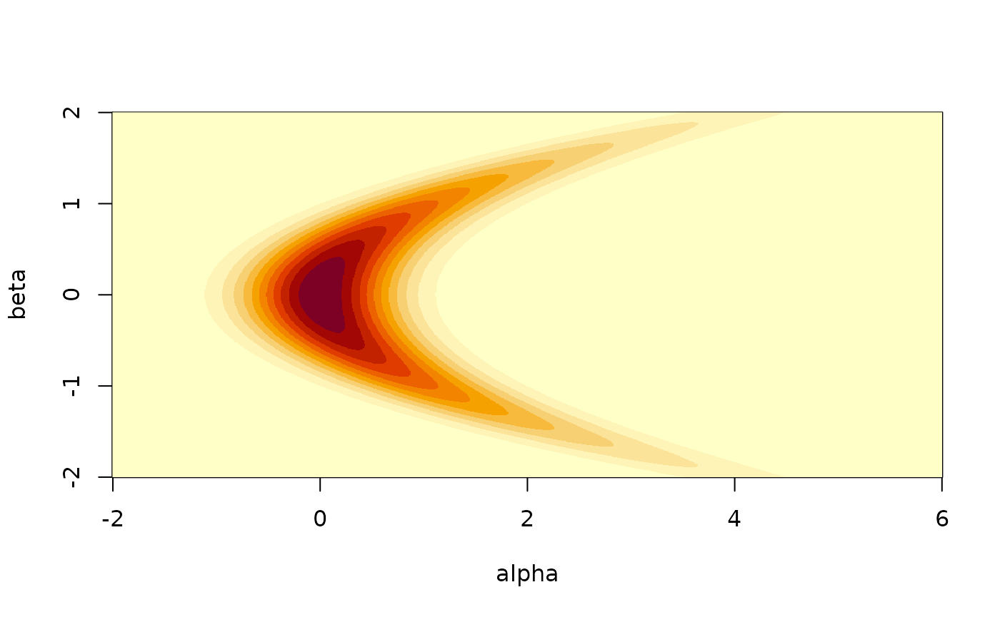
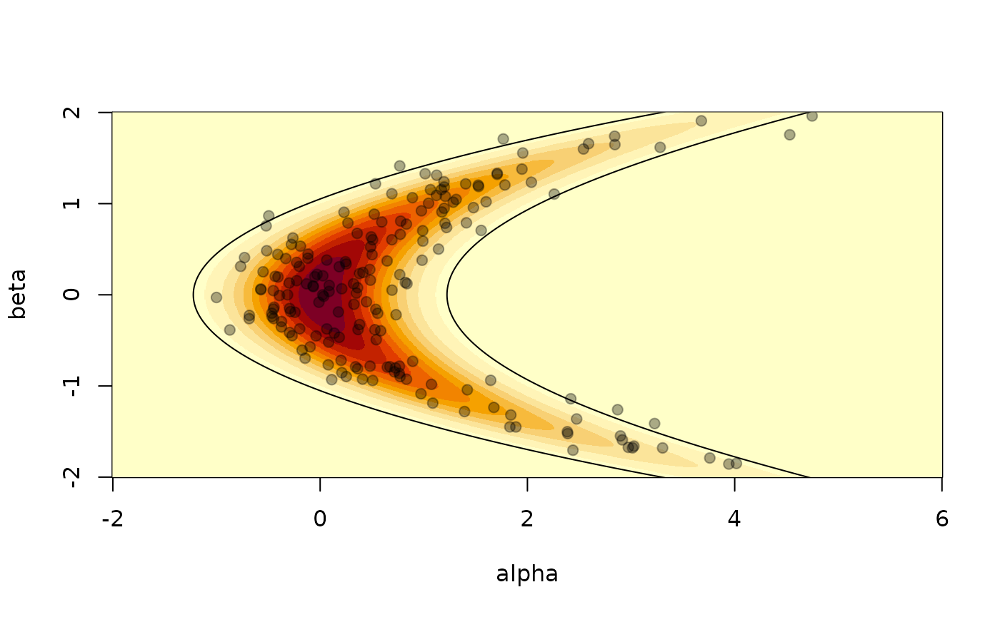
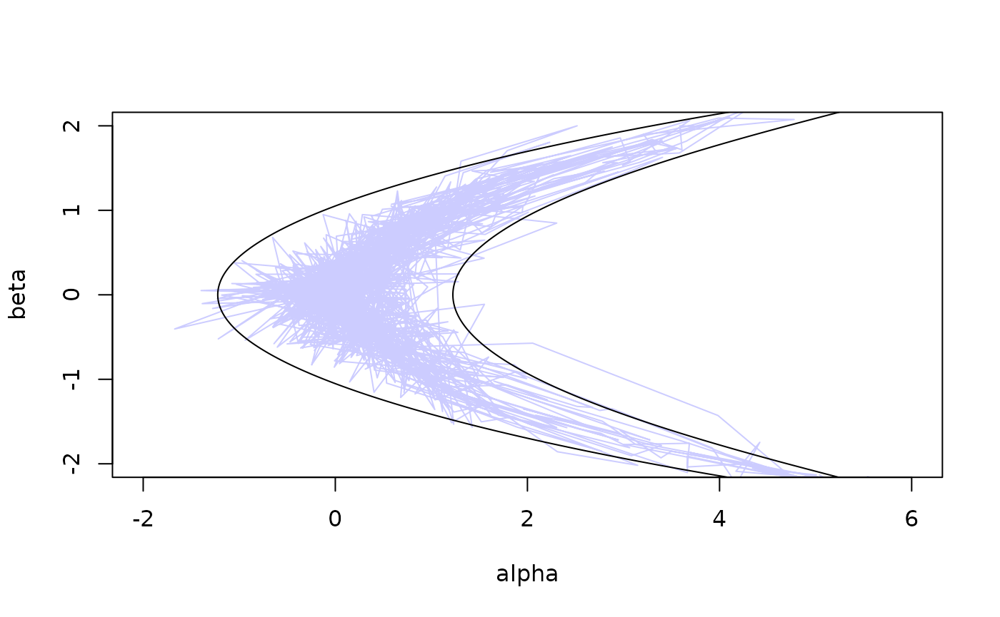

# Samplers

This vignette will describe the samplers available in monty.

``` r
library(monty)
```

## Comparisons

### The bendy banana

This example shows HMC outperforming a random walk on a two dimensional
banana-shaped function. Our model takes two parameters `alpha` and
`beta`, and is based on two successive simple draws, with the one
conditional on the other, so $\beta \sim Normal(1,0)$ and
$\alpha \sim Normal\left( \beta^{2},\sigma \right)$, with $\sigma$ the
standard deviation of the conditional draw.

We include this example within the package; here we create a model with
$\sigma = 0.5$

``` r
m <- monty_example("banana", sigma = 0.5)
m
#> 
#> ── <monty_model> ───────────────────────────────────────────────────────────────
#> ℹ Model has 2 parameters: 'alpha' and 'beta'
#> ℹ This model:
#> • can compute gradients
#> • can be directly sampled from
#> • accepts multiple parameters
#> ℹ See `?monty_model()` for more information
```

We can plot a visualisation of its density by computing the density over
a grid. Normally this is not possible of course:

``` r
a <- seq(-2, 6, length.out = 1000)
b <- seq(-2, 2, length.out = 1000)
z <- outer(a, b, function(alpha, beta) {
  exp(monty_model_density(m, rbind(alpha, beta)))
})
image(a, b, z, xlab = "alpha", ylab = "beta")
```



In this particular case we can also easily generate samples, so we know
what a good sampler will produce:

``` r
rng <- monty_rng_create()
s <- vapply(seq(200), function(x) m$direct_sample(rng), numeric(2))
image(a, b, z, xlab = "alpha", ylab = "beta")
points(s[1, ], s[2, ], pch = 19, col = "#00000055")
```


It is also possible to compute the 95% confidence interval of the
distribution using the relationship between the standard bivariate
normal distribution and the banana shaped distribution as defined above.
We can check that roughly 10 samples (out of 200) are out of this 95% CI
contour.

``` r
theta <- seq(0, 2 * pi, length.out = 10000)
z95 <- local({
  sigma <- 0.5
  r <- sqrt(qchisq(.95, df = 2))
  x <- r * cos(theta)
  y <- r * sin(theta)
  cbind(x^2 + y * sigma, x)
})
image(a, b, z, xlab = "alpha", ylab = "beta")
lines(z95[, 1], z95[, 2])
points(s[1, ], s[2, ], pch = 19, col = "#00000055")
```



### Sampling with other samplers

It is not generally possible to directly sample from a density
(otherwise MCMC and similar methods would not exist!). In these cases we
need to use a sampler based on the density and if available possibly the
gradient of the density.

We can start with a basic random-walk sampler:

``` r
sampler_rw <- monty_sampler_random_walk(vcv = diag(2) * 0.01)
res_rw <- monty_sample(m, sampler_rw, 1000)
#> ⡀⠀ Sampling  ■                                |   0% ETA:  3s
#> ✔ Sampled 1000 steps across 1 chain in 41ms
#> 
plot(t(drop(res_rw$pars)), type = "l", col = "#0000ff66",
     xlim = range(a), ylim = range(b))
lines(z95[, 1], z95[, 2])
```


As we can see this is not great, exhibiting strong random walk behaviour
as it slowly explores the surface (this is over 1,000 steps). Another
way to view this is the parameters varying over steps:

    matplot(t(drop(res_rw$pars)), lty = 1, type = "l", col = c(2, 4),
            xlab = "Step", ylab = "Value")

We can probably improve the samples here by finding a better variance
covariance matrix (VCV), but a single VCV will not hold well over the
whole surface because it is not very similar to a multivariate normal
(that is, the appropriate VCV will change depending on the position in
parameter space)

Let’s try the Hamiltonian Monte Carlo (HMC) sampler, which uses the
gradient to move efficiently in parameter space:

``` r
sampler_hmc <- monty_sampler_hmc(epsilon = 0.1, n_integration_steps = 10)
res_hmc <- monty_sample(m, sampler_hmc, 1000)
plot(t(drop(res_hmc$pars)), type = "l", col = "#0000ff33",
     xlim = range(a), ylim = range(b))
lines(z95[, 1], z95[, 2])
```



or viewed over steps:

``` r
matplot(t(drop(res_hmc$pars)), lty = 1, type = "l", col = c(2, 4),
        xlab = "Step", ylab = "Value")
```


Clearly better!
